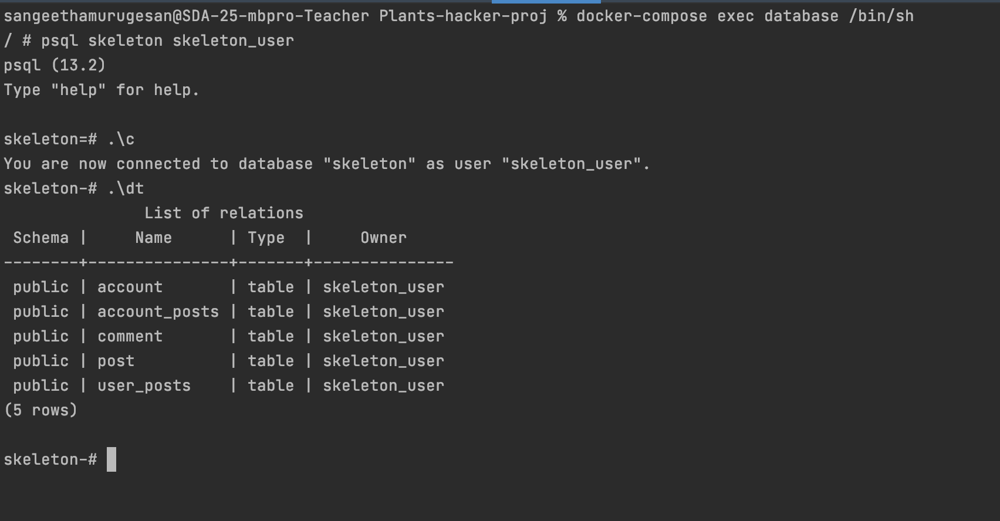
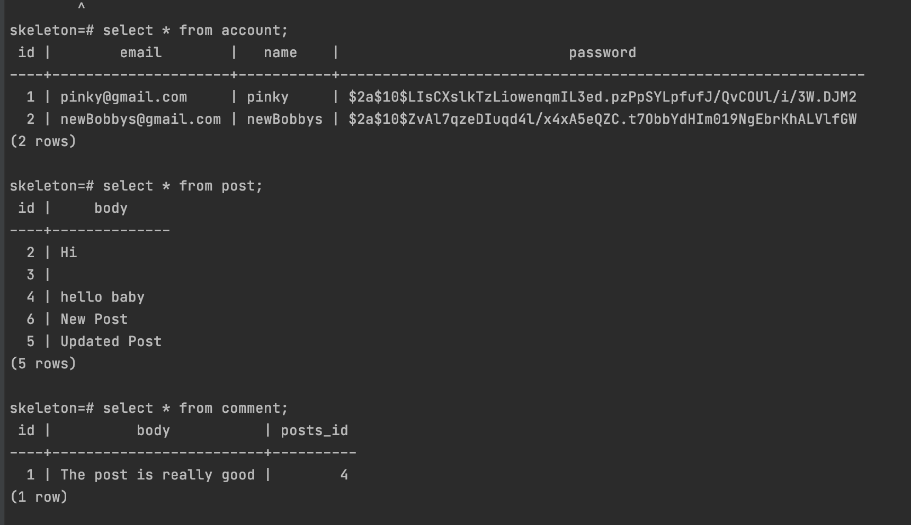

## PlantsHacker

## Introduction
This application is a Online Discussion Forum built with gradle.
The global population is increasing rapidly. And we need more
food and other products to meet up this huge demand. Traditional
farming can’t feed up these demands and we must have to use modern
farming methods. Modern farming can also be a great source of
employment and income. The unemployed people can start agribusiness.
Thus we can make a strong economy and hunger free world. One of the major challenges we identified while working with farmers in India is an information gap and ease of access to that information.

## Getting Started

The web application is made up of three parts: database, backend  (Spring)
and frontend (React).The application can run directly via Gradle. The code for this application uses the Gradle build tool (https://gradle.org.). Instructions for
installing Gradle are available in the official documentation(https://gradle.org/install)
which describes several options.

The User have to register and login.

## Front-end React
Front-end for this application is built with Create React App.

```sh
npx create-react-app my-app
cd my-app
npm install
npm start

```

_If you've previously installed `create-react-app` globally via `npm install -g create-react-app`, its recommended to uninstall the package using `npm uninstall -g create-react-app` or `yarn global remove create-react-app` to ensure that npx always uses the latest version._

_[npx](https://medium.com/@maybekatz/introducing-npx-an-npm-package-runner-55f7d4bd282b) comes with npm 5.2+ and higher._

_Then open [http://localhost:3000/](http://localhost:3000/) to see the application.<br>_


## How to Run the Application
The application can also be run via terminal with the Gradle.

```
./gradlew bootRun
```
To Stop Running the Application:

```
Crtl + C
```
## Setup
We need to configure the following dependencies in `build.gradle`:

```Dependencies:
plugins {
	id 'org.springframework.boot' version '2.2.0.RELEASE'
	id 'io.spring.dependency-management' version '1.0.8.RELEASE'
	id 'java'
}

group = 'se.kth.sda'
version = '0.0.1-SNAPSHOT'
sourceCompatibility = '11'

configurations {
	developmentOnly
	runtimeClasspath {
		extendsFrom developmentOnly
	}
}

repositories {
	mavenCentral()
}

dependencies {
	implementation 'org.springframework.boot:spring-boot-starter-data-jpa'
	implementation 'org.springframework.boot:spring-boot-starter-security'
	implementation 'org.springframework.boot:spring-boot-starter-thymeleaf'
	implementation 'org.springframework.boot:spring-boot-starter-web'
	developmentOnly 'org.springframework.boot:spring-boot-devtools'
	compile group: 'com.auth0', name: 'java-jwt', version: '3.8.3'
	runtimeOnly 'org.postgresql:postgresql'
}

```

`src/main/resources/application.properties` should be configured:
```properties
spring.jpa.database=POSTGRESQL
spring.datasource.platform=postgres
spring.datasource.url=jdbc:postgresql://localhost:5431/skeleton
spring.datasource.username=skeleton_user
spring.datasource.password=skeleton_pass
spring.jpa.show-sql=true
spring.jpa.generate-ddl=true
spring.jpa.hibernate.ddl-auto=create
spring.jpa.properties.hibernate.jdbc.lob.non_contextual_creation=true
```
## DataBase Setup
A Dockerized PostgreSQL database:

The docker-compose.yaml is manually created.
To create docker-compose from the terminal ,we need to use the command
```touch docker-compose.yaml ```

and docker-compose.yaml should contain the following.
```docker-compose.yaml
version: "3"
services:
database:
image: postgres:13-alpine
environment:
- POSTGRES_DB=skeleton
- POSTGRES_USER=skeleton_user
- POSTGRES_PASSWORD=skeleton_pass
ports:
- "5431:5432"
volumes:
- db-data:/var/lib/postgresql/data

volumes:
db-data:
```

## Docker Commands
1.Start container
```
docker-compose up
```
2.Stop container
```
docker-compose down
```
3.List all Running Containers
```
docker ps
```
4.Enter the Running Container
```
docker-compose exec database /bin/sh
```
5.(psql Commands) While inside a postgres container, enter the postgres database.
```
psql skeleton skeleton_user
```
6.psql Commands (when inside the database)
Connect to DataBase:
```bash
\c
```
7.Show the tables in the database
```bash
\dt
```
8.Show all rows in particular table
```
SELECT * FROM account;
```

## Usage
After logging in,the User can
Make a post ,Delete a post ,Update a post and View all posts.The user can also
Write a comment on a post ,Delete a comment on a post ,View all comments on a post.

### Post
The Users are able to post different (text) posts,Update a post and View all posts.

Below are the End-points:

| HTTP Method | HTTP Path | Action |
| ------------|-----------|--------|
| `GET`    |  `/posts`     | return all posts. |
| `GET`    | `/posts/{id}` | return a specific post based on the provided id. |
| `POST`   | `/posts`    | create a new post. |
| `PUT`    | `/posts/{id}` | update the given posts. |
| `DELETE` | `/posts/{id}` | delete the given article. |

### Comment

The Users are able to comment the different posts. They can also Delete a comment on a post ,
View all comments on a post.

## DataBase ScreenShots

## Running the Containers,Entering the Postgres DataBase and Connecting to DB to view the DB tables.



## To view all the rows in the particular table (account,post,comment)




